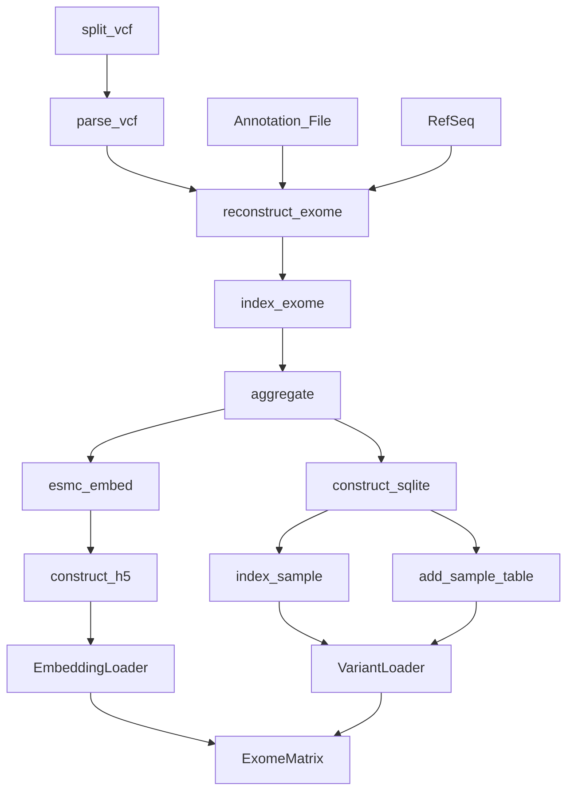
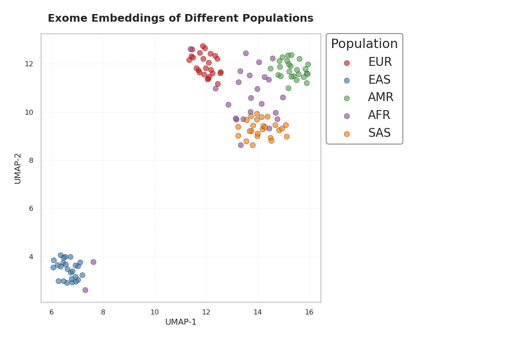

# UKBiobank GWAS - Deep Learning

### Data Preparation Pipeline

```mermaid
graph TD
    A[split_vcf] --> B[parse_vcf]
    B --> C[reconstruct_exome]
    K[Annotation_File] --> C
    L[RefSeq] --> C
    C --> D[index_exome]
    D --> E[aggregate]
    E --> F[esmc_embed]
    E --> G[construct_sqlite]
    G --> I[index_sample]
    G --> J[add_sample_table]
    F --> H[construct_h5]
    H --> S[EmbeddingLoader]
    I --> V[VariantLoader]
    J --> V
    S --> X[ExomeMatrix]
    V --> X

```
